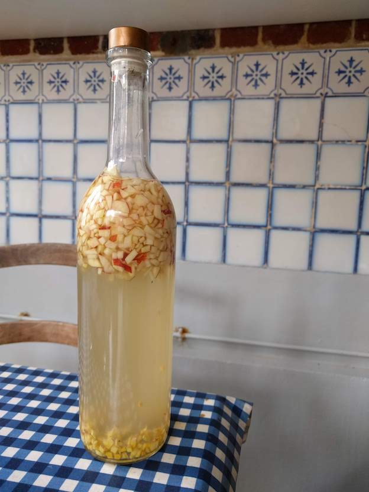
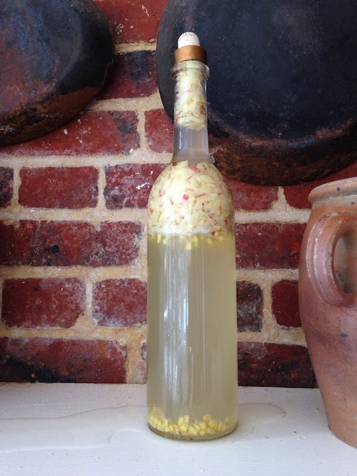

# Apple and ginger kefir
### Second ferment

**Ingredients**  
• A Normandy apple, firm 🍎  
• Diced organic ginger  
• Cane sugar  
• Second ferment from my water kefir grains  

Proportions: roughly enough for a liter batch, see picture.

**Time**  
Made: August 20th  

_Notable fact_: Cork popped open and lost half of the bottle to a fizz parade! On August 24th. 
We drank the rest on that same afternoon.

Enthusiasm ↓

