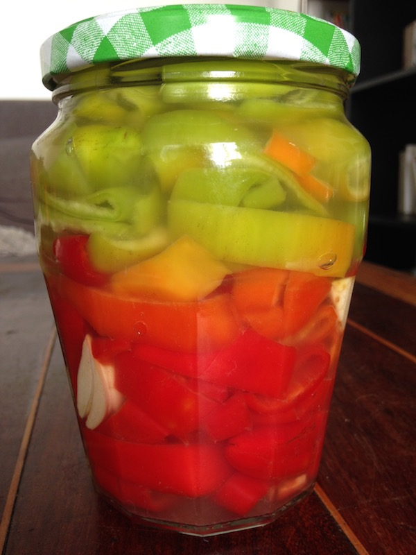

# Chili hot sauce

**Ingredients**  
• Chilies from the organic farmers market in Stoke Newington (are some of these called banana peppers ?) 🌶   
• Two cloves of garlic  
• Sea salt (loads - chopped or mashed peppers mold more easily, so I aimed for a high concentration brine)  
• Mineral water  

**Time & place**  
Made: October 5th 2018  
Place: Bordeaux  
Fermentation time : approx. 2-3 weeks before blending

Lovely colors ↓  

