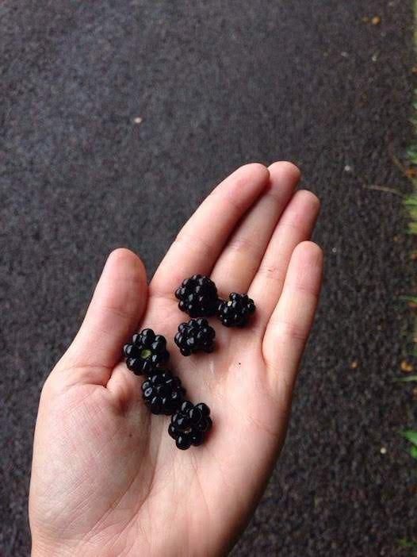

# Foraged berry kefir
### Second ferment

**Ingredients**  
• Berries foraged in Normandy    
• Organic cane sugar  
• Second ferment from my water kefir grains  

Proportions: rough

**Time**  
Made: August 26th  
Had: August 31rst

_Notable fact_: some white fuzz formed on the bottom of the jar. After verification with some fermenter friends on a Facebook group), it turns out that's the healthy bacteria, nothing to worry about.  
The apple and ginger kefir didn't seem to produce that. 
